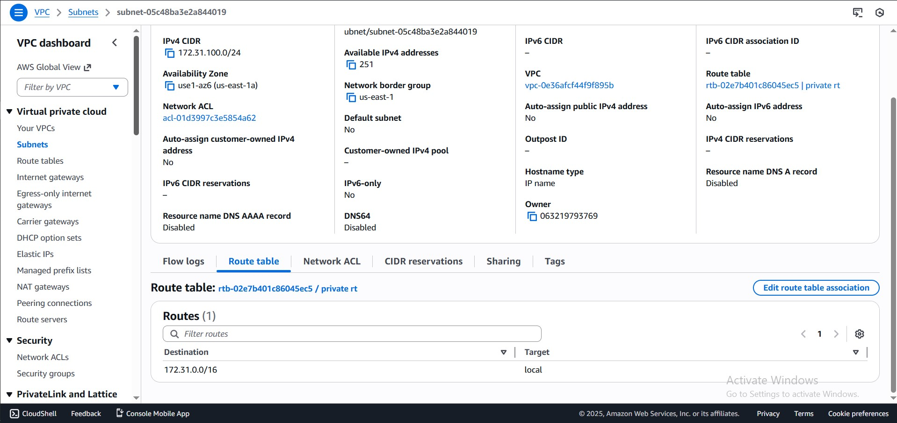
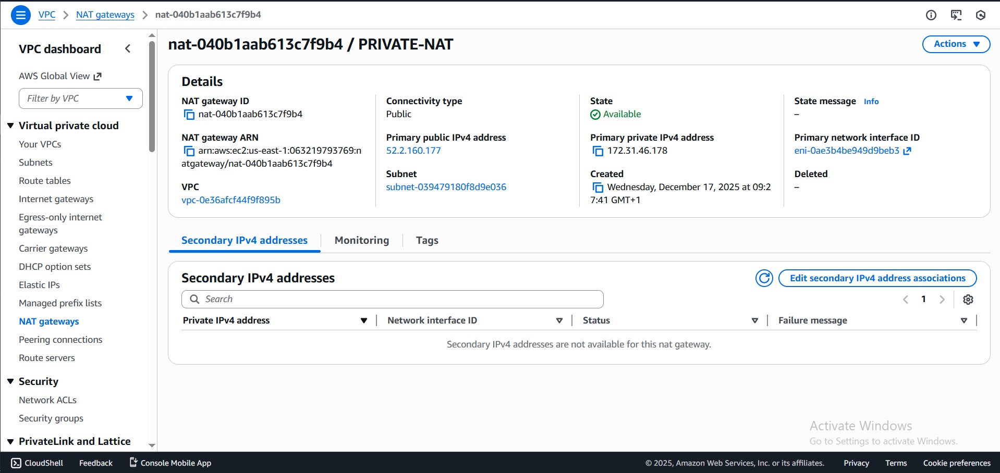
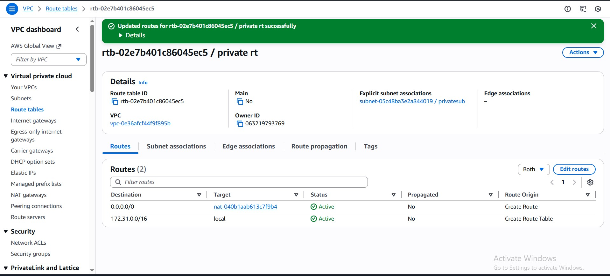
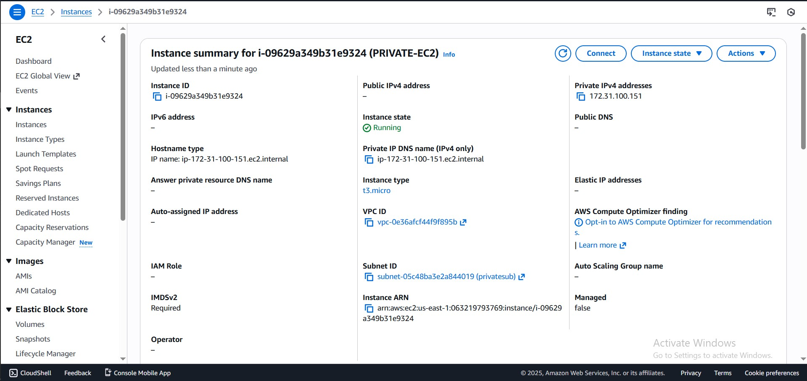
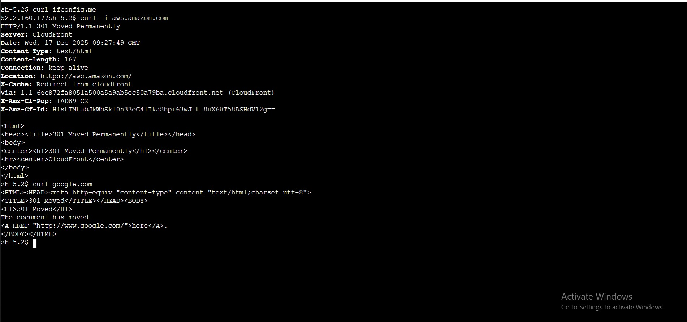
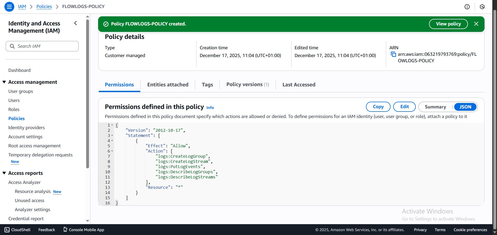
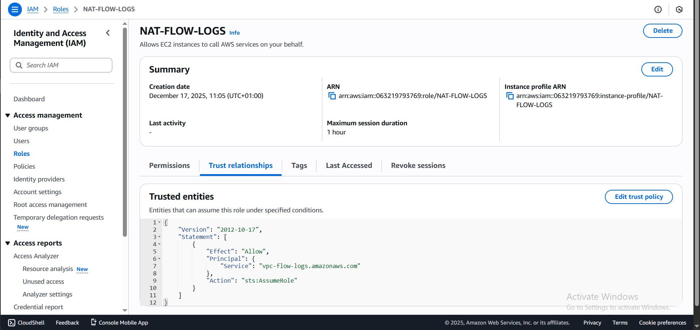
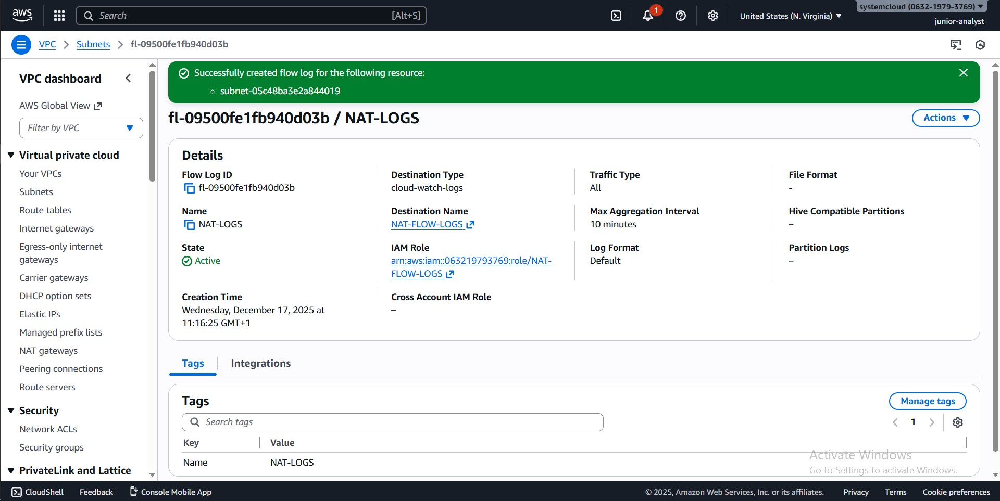

# AWS PROJECT: NAT GATEWAY NETWORK TRAFFIC MONITORING

## MONITORING PRIVATE SUBNET EGRESS TRAFFIC THROUGH NAT GATEWAY USING VPC FLOW LOGS AND AMAZON CLOUDWATCH

## INTRODUCTION

In this project, I implemented network traffic monitoring for a NAT Gateway in AWS using VPC Flow Logs and Amazon CloudWatch. This project was carried out in an environment where a default VPC already existed, containing only public subnets across multiple Availability Zones.
The project involves extending the existing default VPC by introducing a private subnet, configuring proper routing through a NAT Gateway, and then monitoring the resulting network traffic.
This approach closely mirrors real-world cloud environments, where engineers often have to adapt and secure existing infrastructure rather than build from scratch.

## PROJECT OBJECTIVES

- Extend an existing default VPC to support private networking
-	Create a private subnet with no direct internet access
-	Route private subnet outbound traffic through a NAT Gateway
-	Capture NAT Gateway traffic using VPC Flow Logs
-	Store and analyze flow logs in Amazon CloudWatch

# 
 STEPS INVOLVED

## STEP 1 - CREATING A PRIVATE SUBNET IN THE EXISTING VPC

-	Since the Existing VPC only contained public subnets, the first task was to create a new private subnet.
-	I created a new subnet within the default VPC
-	Selected a non-overlapping CIDR block within the default VPC address range
-	Disabled auto-assignment of public IPv4 addresses for the subnet this ensured that resources launched in this subnet would not have direct internet access.
-	I then edited the route table association of the subnet, removing its route to the internet gateway (IGW).

## STEP 2 - NAT GATEWAY DEPLOYMENT
-	To enable outbound internet access for the private subnet it needs a NAT Gateway.
-	I created a NAT Gateway in a public subnet in the same AZ with the private subnet to save cost and improve its performance.
-	I also allocated an Elastic IP address to the NAT gateway during its creation

## STEP 3 - ROUTE TABLE CONFIGURATION
-	Proper routing was essential to ensure traffic flowed through the NAT Gateway.
-	I created a dedicated route table named “PRIVATE RT” for the private subnet
-	I added a default route (0.0.0.0/0) pointing to the NAT Gateway I created
-	I then associated the route table with the private subnet
-	This configuration ensured that all outbound internet traffic from the private subnet was forced through the NAT Gateway.

## STEP 4 - EC2 INSTANCE DEPLOYMENT (TRAFFIC SOURCE)
-	To generate real network traffic, I launched an EC2 instance in the private subnet
-	No public IP address was assigned
-	I was only able to connect to the instance via the session manager which needed me to associate the appropriate IAM role which gave the SSM permission to connect to the instance. (I was glad I learnt that a role was needed for this)
-	This instance relied entirely on the NAT Gateway for outbound connectivity, making it ideal for observing NAT traffic.

## STEP 5 – TESTING THE NAT GATEWAY
-	After connecting to the instance via the session manager, I had to make sure that the instance could reach the internet via the NAT gateway.
-	So, I curled google.com and aws.amazon.com and got a response
-	I used the ‘’curl ifconfig.me” command to ensure the IP the internet was seeing was the elastic IP associated to the NAT gateway

## STEP 6 – CREATING AN IAM ROLE FOR THE FLOW LOGS
-	Before creating Flow Logs for the private subnet, an IAM role was created to allow AWS to publish flow log records to Amazon CloudWatch Logs.
-	I first created a custom policy with least privilege permission required for flow logs to successfully deliver log data to CloudWatch
-	I created a new IAM role with AWS service as the trusted entity
-	Selected EC2 as the use case which I later changed to vpc-flow-logs in the trust policy, because there was no initial provision for vpc flow logs in use case
-	I then attached the initially created policy to the role.
-	This role follows the principle of least privilege and is required for VPC Flow Logs to successfully deliver log data.

## STEP 7 - CREATING VPC FLOW LOGS AT THE SUBNET LEVEL
-	Rather than enabling flow logs at the VPC level, flow logging was configured specifically for the private subnet. This provided more granular visibility into traffic originating from private resources using the NAT Gateway.
-	I navigated to the private subnet using the NAT gateway, clicked on flow log and created the flow log.
-	I also attached the flow log role created in step 6 to it
-	The flow log was ready to capture any traffic going through the NAT gateway and sends it to CloudWatch.  

